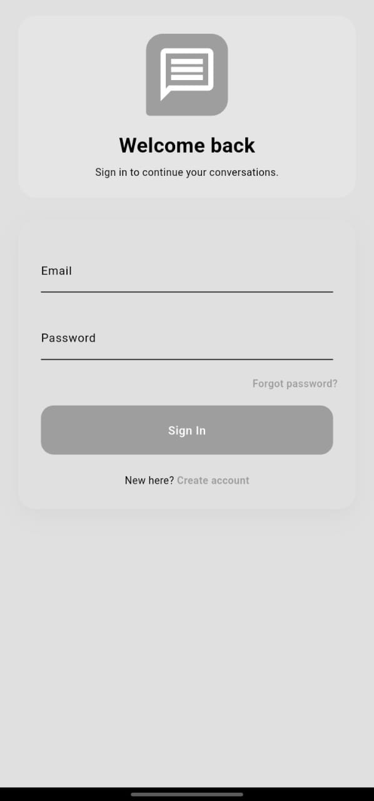
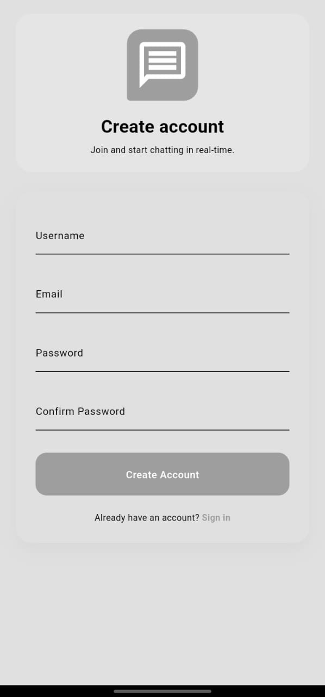
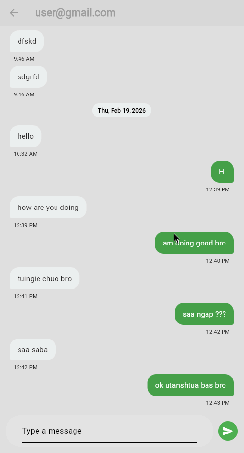
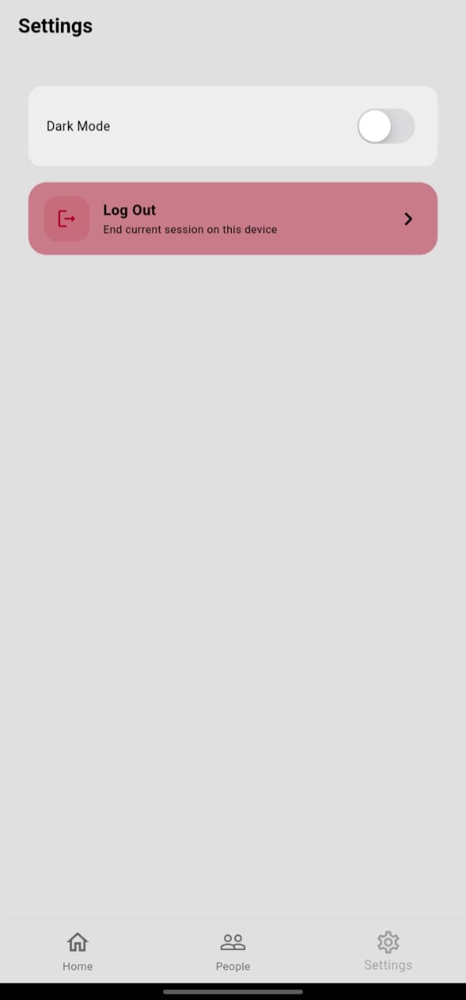

# Chatting App

A Flutter chat application with Firebase authentication, real-time messaging, unread counters, and notifications.

## App Screenshots


### Login Screen



### Register Screen



### Home Screen

.jpeg)

### All Users Screen

.jpeg)


### Chatting Screen




### Settings Screen



## Features

- Email/password authentication (register, login, forgot password)
- Real-time 1:1 chat using Cloud Firestore
- Existing chats list and all users list
- Unread message counts per conversation
- Push + local notifications via Firebase Cloud Messaging
- Light/Dark theme toggle (Provider)
- Cross-platform Flutter targets (Android, iOS, Web, Desktop)

## Tech Stack

- Flutter
- Firebase Core
- Firebase Authentication
- Cloud Firestore
- Firebase Cloud Messaging
- flutter_local_notifications
- Provider

## Prerequisites

- Flutter SDK (matching `environment.sdk: ^3.10.8` in `pubspec.yaml`)
- Firebase project
- FlutterFire CLI (`dart pub global activate flutterfire_cli`)
- Android Studio / Xcode (for mobile builds)

## Firebase Setup

1. Create a Firebase project.
2. Enable Authentication:
   - Go to **Authentication > Sign-in method**
   - Enable **Email/Password**
3. Create Firestore Database (production/test mode as needed).
4. Configure Cloud Messaging (FCM).
5. Add app platforms in Firebase (Android/iOS/Web as needed).
6. Generate Flutter Firebase options:

```bash
flutterfire configure
```

This updates `lib/firebase_options.dart`.

7. Ensure Android config file exists:
   - `android/app/google-services.json`

For iOS, add the `GoogleService-Info.plist` file in the iOS Runner project if you target iOS.

## Installation

```bash
flutter pub get
```

## Run the App

```bash
flutter run
```

## Project Structure

```text
lib/
  main.dart
  firebase_options.dart
  components/
  models/
  pages/
  provider/
  services/
    auth/
    chats/
    notifications/
  theme/
```

## Firestore Data Model (high-level)

- `Users/{uid}`
  - `uid`, `email`, `username`
  - `fcmToken`, `fcmTokens`, `fcmUpdatedAt`
- `chat_rooms/{sortedUidA_sortedUidB}`
  - `participants`, `lastMessage`, `lastMessageTimestamp`
  - `lastSenderID`, `lastSenderEmail`
  - `unreadCounts.{uid}`
- `chat_rooms/{roomId}/messages/{messageId}`
  - `senderID`, `senderEmail`, `receiverID`, `message`, `timestamp`

## Notifications

- Foreground notifications are shown using `flutter_local_notifications`.
- Background handling is configured through `FirebaseMessaging.onBackgroundMessage`.
- FCM tokens are stored per user in Firestore and synced on auth/token changes.

## Notes

- If Firebase is not configured, app startup will fail at `Firebase.initializeApp(...)`.
- Keep Firebase config files out of public repos when appropriate for your security policy.

## Testing

```bash
flutter test
```

---

## 👥 Project Participants

| #  | Full Name                         | Registration Number | GitHub Username |
|----|----------------------------------|--------------------|----------------|
| 1  | BRAYAN TEMIHANGA MLAWA            | NIT/BIT/2023/2111  | [@Cylvenda](https://github.com/Cylvenda) |
| 2  | MADUHU K MAGUGWAN                 | NIT/BIT/2023/2157  | [@Magugwani](https://github.com/Magugwani) |
| 3  | DARIUS DEOCRES BALAS              | NIT/BIT/2023/2197  | [@BALASbalas](https://github.com/BALASbalas) |
| 4  | TUNU NICOLAUS NDETENGA            | NIT/BIT/2023/2241  | [@Tunujennin](https://github.com/Tunujennin) |
| 5  | JOHNSON GODFREY TEMBO             | NIT/BIT/2023/2227  | [@johnsontembo19-cmyk](https://github.com/johnsontembo19-cmyk) |
| 6  | SIIMA AUDAX KARUBAGA              | NIT/BIT/2023/2052  | [@siimakarugaba45-netizen](https://github.com/siimakarugaba45-netizen) |
| 7  | GODWIN SHILLA                     | NIT/BIT/2023/2119  | [@shilla018](https://github.com/shilla018) |
| 8  | KASOBOZI ANDREW KASOBOZI          | NIT/BIT/2023/2180  | [@kasoboziandrew-svg](https://github.com/kasoboziandrew-svg) |
| 9  | RAMADHANI M SENGULO               | NIT/BIT/2023/2106  | [@Sengulo](https://github.com/Sengulo) |
| 10 | SAMWELI ISSACK MKUTA               | NIT/BIT/2023/2347  | [@Lastbweb](https://github.com/Lastbweb) |
| 11 | VIVIAN DAVID JACOBU                | NIT/BIT/2023/2149  | [@viviandavid028](https://github.com/viviandavid028) |
| 12 | ELISHA MARTIN                      | NIT/BIT/2023/2334  | [@elishamwakipesile893-coder](https://github.com/elishamwakipesile893-coder) |
| 13 | AMIR B BRUHAN                      | NIT/BIT/2023/2162  | [@Amiribruhan](https://github.com/Amiribruhan) |
| 14 | MANGUYA JUMA                       | NIT/BIT/2023/2065  | [@Manguyajuma](https://github.com/Manguyajuma) |
| 15 | KELVIN KAMETA                      | NIT/BIT/2023/2174  | [@Calvin72-lab](https://github.com/Calvin72-lab) |

---

